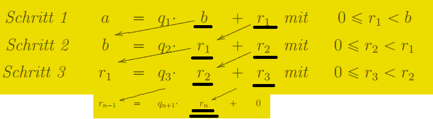
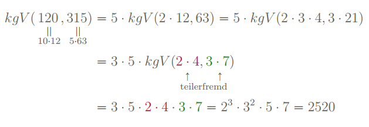

Klausurraum: <https://univis.fau.de/formbot/dsc_3Danew_2Froom_view_26rooms_3Dphil_2Fsephil_2Flgcrn_2Fhsewf_2F1132_26dir_3Dphil_2Fsephil_2Flgcrn_2Fhsewf_26ref_3Droom>

Ich selbst habe den Beweis des Satzes 3.15 geskipped

Gelesen bis vor Kapitel 8, Seite 99.

nächstes Video: https://www.fau.tv/clip/id/3608 (ab 01:01 h)

https://www.fau.tv/clip/id/3542 skipped (WeihnachtsVL, nicht klausurrelevant laut ihr)

(I): ∀b: ℕ. |{p prime | ∃a: ℕ. p ≡ a mod b ∧ gcd(a, b) = 1}| = ∞
(II): ∀a: ℕ. ∀b: ℕ. gcd(a, b) = 1 ⇒ |{p prime | p ≡ a mod b}| = ∞

Übungsaufzeichnung für Übung 3 angeguckt

ggT mit PFZ: https://www.video.uni-erlangen.de/clip/id/3373, 1:20

https://en.wikipedia.org/wiki/B%C3%A9zout%27s_identity#For_three_or_more_integers


Klausur:
	- ggT mittels euklidischem Algo können und was sonst noch mit eukl. Algo zsmhängt
	  genaues Schema in Klausur reproduzieren mit
	  a = q  * b + r
	  b = q' * r + r'
	- schriftliche Multiplikation
	- schriftliche Division
	- Proben nicht vergessen!
	- Skript erlaubt?

in Klausur: TR erlaubt? Zumindest laut Aufzeichnung 2013. Nutze meinen Casio fx-991DE PLUS mit ":R"-Taste!
Klausur: RECHENAUFGABEN


`ggT(a*c, b*c) = c` wenn b, c teilerfremd?

Für a, b in N: a/ggT(a,b) und b/ggT(a,b) teilerfremd, d.h. ggT(a/ggT(a,b), b/ggT(a,b)) = 1.

## Umwandlung mod-Gleichung <-> Teilbarkeitsgleichung

- $a \mid b - c \Leftrightarrow b \equiv c$ (mod a)

## Algorithmen

## Erweiterter Euklidischer Algorithmus für `ggT(a, b)`



Erweitert: durch Rückeinsetzen $r_n$ mittels Linearkombination $a$ und $b$ ausdrücken.

## Lösungen von $ax + by = c$ mit $(x, y) ∈ ℤ²$

Sei die Gleichung $ax + by = c$ mit $a, b, c ∈ ℤ$ gegeben. Gesucht ist Lösungsmenge von $(x, y)$ Paaren.

1. Berechne $\mathrm{ggT}(a, b)$ mit erw. Euklidischen Algorithmus
2. Falls *nicht* $\mathrm{ggT}(a, b) ∤ c$, dann unlösbar nach Satz 4.15. Terminiere.

   > **Satz 4.15:** Es gilt:
   > $$\mathrm{im}(\underbrace{ax + by}_{∈ ℤ[x,y]}) = \mathrm{ggT}(a, b)ℤ$$
   >
   > $$\mathrm{im}(\underbrace{a₁x₁ + … + a_nx_n}_{∈ ℤ[x₁, …, x_n]}) = \mathrm{ggT}(a₁, …, a_n)ℤ$$

3. Berechne Bezout-Koeffizienten: $\mathrm{ggT}(a, b) = ax^\ast + by^\ast$
   
   Falls $\mathrm{ggT}(a, b) ≠ 1$, dann betrachte restlichen Algorithmus über transformierte Gleichung (Lsg.menge bleibt gleich)
   $$\frac{a}{\mathrm{ggT}(a, b)} x + \frac{b}{\mathrm{ggT}(a, b)} y = \frac{c}{\mathrm{ggT}(a, b)}$$s

   Möglich, da $\mathrm{ggT}(a, b) \mid a,b,c$ nach Annahme und da $\mathrm{ggT}(a, b)$ kein Nullteiler in ℤ ist.
   
   Die Bezout-Koeffzienten sind *dieselben*, denn:
   $1 = \frac{\mathrm{ggT}(a,b)}{\mathrm{ggT}(a, b)} = \frac{a}{\mathrm{ggT}(a, b)}x^\ast + \frac{b}{\mathrm{ggT}(a, b)}y^\ast$
   
   Insgesamt nötig, da sonst Satz 4.18 in Schritt 5 nicht anwendbar.

4. Berechne **Partikularlösung**, angenommen $ax^\ast + by^\ast = 1 = \mathrm{ggT}(a,b)$
   
   Sei $\mathrm{ggT}(a,b) \mid c$ via $q$ (d.h. $q ⋅ \mathrm{ggT}(a,b) = c$).

   $\Rightarrow a(qx^\ast) + b(qy^\ast) = q · \mathrm{ggT}(a,b) = c$<br>
	 $\Rightarrow (qx^\ast, qy^\ast)$ Partikularlösung
5. Berechne **alle Lösungen**: $\mathcal{L} = \{(q x^\ast - t⋅b, q y^\ast + t⋅a), t ∈ ℤ\}$ (Satz 4.18)
	 
	 Je nach Anwendungsaufgabe, stelle $q x^\ast - t⋅b ≥ 0$ und $q y^\ast + t⋅a ≥ 0$ auf; löse nach $t$, um alle (endlich) viele Lösungen zu erschließen.

Lineare dipohantische Gleichung hat entweder 0 oder unendlich viele Lösungen.

### Beispiel 1

Werbegeschenkaufgabe von S. 44: 19x + 13y = 1000, wie viele Lösungen (x,y) mit x, y >= 0 gibt es? 4 Lösungen.

Abwandlung von mir: 31x + 23y = 1000, wie viele Lösungen (x,y) mit x, y >= 0 gibt es? 13 Lösungen.

### Beispiel 2

Finde alle Lösungen von `6x + 4y = 14`.

1. `ggT(6, 4) = 2 = 1 * 6 - 1 * 4`
2. `ggT(6, 4) = 2 | 14`, okay!
3. Normalisierung: `3x + 2y = 7`, rekursiv:

   1. Berechne
   
      ```
      3 = 1·2 + 1
      2 = 2·2 + 0
      
      ⇒ 1 = (1)·(3) + (-1)·(2)
      ```
   2. `ggT(3, 2) = 1 | 7`, okay!
4. Partikularlösung: `7 · (1, -1) = (7, -7)`
5. Alle Lösungen: `L = {(7 + 2⋅t, -7 - 3⋅t) | t in ℤ} = {…, (5, -4), ___(7, -7)___, (9, -10), (11, -13), …}` (dieselben Lösungen von ursprünglicher Gleichung)

### Beispiel 3 (mit negativen Koeffizienten!)

Finde alle Lösungen von `-51x + 5y = 13`.

1. Sofort klar: `ggT(-51, 5) = ggT(51, 5) = 1`
   Berechne trotzdem:

   ```
   -51 = -11 ⋅ 5 + 4
     5 =   1 ⋅ 4 + 1
     4 =   4 ⋅ 1 + 0
   
   ⇒ 1 = (-1)⋅(-51) + (-10)⋅(5)
   ```

2. `ggT(-51, 5) = 1 | 13`, d.h. unendlich viele Lösungen existieren!
3. -/-
4. Partikularlösung `13 ⋅ (-1, -10) = (-13, -130)`.
5. Alle Lösungen: `L = {(-13 + 5⋅t, -130 - (-51)⋅t), t ∈ ℤ}`


## kgV

- manuell: 

- geschickter: nutze $ggT(a,b) ⋅ kgV(a,b) = a⋅ b$
- für $ggT(a,b) = 1 ⇒ kgV(a,b) = a ⋅ b$

## Additives Inverse in ℤ/mℤ

- Problem: gesucht ist Inverses von `[a] ∈ ℤ/mℤ`
- Lösung: `[-a]`

## Multiplikatives Inverse in ℤ/mℤ

- **Problem:** gesucht ist Inverses von $\bar{a} ∈ ℤ/mℤ$, $0 \leq a < m$!!!
- **Lösung:**
  - Inverses existiert gdw. $\mathrm{ggT}(a, m) = 1$.
  - Löse $ax + my = 1$ via Algorithmus oben, nehme Partikularlösung $x^\ast$.
  - Ggf. normalisiere erhaltenes $x^\ast$ auf kanonischen Repräsentanten in $\{0, …, m - 1\}$.

- Begründung: *Eine* Lösung ist $x$, sodass $ax \equiv 1 \text{ (mod } m \text{)} \Leftrightarrow m \mid ax - 1 \Leftrightarrow \exists y.\ ax - my = 1 \Leftrightarrow \exists y.\ ax + my = 1$
  

Beispiele:

- In ℤ/13ℤ: $\overline{6}^{-1} = \overline{11}$
- In ℤ/89ℤ: $\overline{15}^{-1} = \overline{6}$

## Nullteiler

`zero divisor := Σ(a:R) Σ(b:R) a ≠ 0 ∧ b ≠ 0 ∧ ab = 0` (def. from lecture; usually `0` *is* considered a zero divisor…)

e.g. in ℤ/6ℤ: `(2, 3)` is zero divisor

## Bestimme Rest von $a^b ÷ m$

> Wenn $a$ und $m$ teilerfremd, wende Satz von Euler an:
>
> $$[a^b]_m = [a]_m^b = [a]_m^{[b]_{\varphi(m)}}$$

Beispiel:
$$[3^{387}]_{35} = [3]_{35}^{[387]_{24}} = [3]_{35}^{[3]_{24}} = [27]_{35}$$

da $\varphi(35) = \varphi(5 ⋅ 7) = 4 ⋅ 6 = 24$.

> Wenn $a$ und $m$ *nicht* teilerfremd, betrachte $\langle [a]_m, ⋅ \rangle$ und identifziere Periodenlänge $s$, sodass
>
> $$[a^b]_m = [a]_m^b = [a]_m^{b'}$$
> wobei $b'$ positiver Repräsentant von $[b]_s$ ist.

Beispiel:
$$[2^{18}]_{10} = [2]_{10}^{2} = [4]_{10}$$
da $\langle [2]_{10} \rangle = \{[1]_{10}, [2]_{10}, [4]_{10}, [8]_{10}, [16]_{10} = [6]_{10}, [12]_{10} = [2]_{10}\}$, d.h. $[2]_{10}^5 = [2]_{10}$. Damit ist $s = 4$.
Und ein positiver Repräsentant von $18$ in $ℤ/sℤ$ ist eben $2$.


## Gleichungen über Z

Wenn a Faktor von LHS und RHS, dann `LHS = RHS ⇔ LHS/a = RHS/a`.

# Verschiedenes

finite commutative monoids with (∀abc. ab = ac => b=c) are groups

## Alle ungeraden Quadratzahlen $≡ 1$ mod 8

Sei $q ∈ ℤ$ und $q^2$ ungerade. Dann ist $q$ ungerade.

$\bar{q^2} = \bar{q}^2 ∈ \{\bar{1}^2, \bar{3}^2, \bar{5}^2, \bar{7}^2\} = \{\bar{1}\} ⇒ q^2 ≡ 1$ (mod 8)

Alternativ: $q^2 = (2n + 1)² = 4n² + 4n + 1 = 4n(n+1) + 1 ≡ 1$, da $8 ∣ 4n(n+1)$, denn $2 ∣ n(n+1)$.

## Satz von Euler, Kleiner Fermat'sche Satz

> **Satz (von Euler):** Seien $a, m$ teilerfremd, dann $a^{\varphi(m)} ≡ 1$ (mod m).

(Folgt aus: $a, m$ teilerfremd $⇒ \bar{a} ∈ ℤ_m^∗ ⇒ \bar{1} = \bar{a}^{\mathrm{ord}(ℤ_m^\ast)} = \bar{a}^{\varphi(m)}$; group element raised to group order always 1)

> **Satz (kleiner Fermat):** Für $a ∈ ℕ$, $p$ prim gilt: $a^p ≡ a$ (mod p)

Wenn $p ∣ a$, trivial $0 ≡ 0$. Sonst $\mathrm{ggT}(a, p) = 1$ und $a^p ≡ a^{p-1}a ≡ 1a ≡ a$.

> **Lemma:** $\varphi(p^n) = p^{n-1} (p-1)$

> **Lemma:** (aus Internet!) $\mathrm{ggT}(a,b) = 1 \quad\Longrightarrow\quad \varphi(a ⋅ b) = \varphi(a) ⋅ \varphi(b)$
>
> *Beweis (siehe auch [hier](https://math.stackexchange.com/a/192456/85341)):* Nach CRT haben wir $ℤ/(abℤ) ≅ ℤ/aℤ × ℤ/bℤ$. D.h. Anzahl invertierbarer Elemente von LHS ist dieselbe wie von RHS. Ein Element $(x, y)$ von RHS ist invertierbar gdw. $x$ in $ℤ/aℤ$ invertierbar und $y$ in $ℤ/bZ$ invertierbar ist. Es gibt also $\varphi(a) ⋅ \varphi(b)$ viele invertierbare Elemente der RHS.

## Chinesischer Restsatz

- Problem: Gleichungen der Form $x ≡ a_i$ (mod $m_i$)

  - $x ≡ 3$ (mod 5)
  - $x ≡ 1$ (mod 7)
  - $x ≡ 2$ (mod 11)

  **mit $m_i$ paarweise teilerfremd**. Gibt es Lösung für $x ∈ ℤ$?

- Ja, es gibt eine Lösung $x$ (eindeutig in $ℤ/mℤ$, mit $m := Π m_i$)

  Konstruiere *eine* Lösung $x := a_1 q_1 q_1' + a_2 q_2 q_2' + a_3 q_3 q_3'$ mit

  - $q_1 := 7 ⋅ 11 = 77$

    In $ℤ/5ℤ$: $\bar{q_1} = \bar{2},\quad\bar{2}^{-1} = \bar{3} \Rightarrow$ wähle $q_1' := 3$. (i. Allg. ist $q_1' ∈ 3 + 5ℤ$ möglich)

  - $q_2 = 5 ⋅ 11 = 55$
  
    In $ℤ/7ℤ$: $\bar{q_2} = 6,\quad\bar{q_2}^{-1} = \bar{6} \Rightarrow$ wähle $q_2' := 6$
  - $q_3 = 5 ⋅ 7 = 35$

    In $ℤ/11ℤ$: $\bar{q_3} = 2,\quad\bar{q_3}^{-1} = \bar{6} \Rightarrow$ wähle $q_3' := 6$

  $⇒ x = 3 ⋅ 77 ⋅ 3 + 1 ⋅ 55 ⋅ 6 + 2 ⋅ 35 ⋅ 6 = 1443$

  > Beachte: hier muss etwa $77$ stehen, anderer Repräsentant bzgl. $ℤ/5ℤ$ *nicht* möglich. Für $q_i'$ is jedoch beliebige Repräsentenwahl in $ℤ/m_iℤ$ möglich.

  Mit $m := m_1 m_2 m_3 = 385$ ist Lösungsmenge $\mathcal{L} = x + mℤ = 1443 + 385ℤ = 288 + 385ℤ$.<br>
  Hier ist $x\;\%\;m = 1443\;\%\;385 = 288$ kanonischer Repräsentant.

Andere Formulierung:

> **Satz (CRT):** Wenn $m_1, …, m_k$ paarweise teilerfremd, dann
> $$ℤ/m ≅ ℤ/m_1 × ⋯ × ℤ/m_k$$
> als Ringe.

Falls in Gleichungen Koeffizienten vor $x$ auftauchen: wende [erweiterten CRT](https://www.dave4math.com/mathematics/chinese-remainder-theorem/) an.

## Konvertierung Dezimalsystem $\rightarrow$ b-System

Immer durch $b$ teilen, Reste ergeben $b$-Darstellung.

```
Gesucht: 8924 zur Basis 12
                  _____
8924 = 743 ⋅ 12 + |  8 |  ^   least significant digit
 743 =  61 ⋅ 12 + | 11 |  |
  61 =   5 ⋅ 12 + |  1 |  | 
   5 =   0 ⋅ 12 + |  5 |  |
         ^        -----
         |- terminiert bei 0
Ergebnis: 51B8₍₁₂₎
```

**Nicht mit Euklidischem Algorithmus verwechseln!**

Probe mit TR! Auf Casio fx-991DE Plus: `Mode -> Pfeil runter -> 3 (Base-N) -> 8924 eingeben -> Dec/Hex/Bin/Oct-Taste drücken`

## Schriftliches Addieren/Subtrahieren zur Basis b

Beispiele:

- $455_6 + 1_6$
- $210_3 - 1_3$
- $2302_4 - 233_4 = 2003_4$ (tricky mit Borrow und Carry!!)

## Dezimalbruchentwicklung

- Problem: bestimme Art der Dezimalbruchentwicklung (endlich, rein-/gemischtperiodisch) eines gegebenen Bruches $\frac{m}{n}$
- Lösung:
 
  1. Sind Zähler und Nenner teilerfremd? Bestime $\mathrm{ggT}(m, n)$ mittels Euklidischem Algorithmus und kürze damit
  2. Art *nur* abhängig von Nenner; unterscheide 3 Fälle: Nenner bestehend aus $\{2,5\}$, teilerfremd mit $\{2,5\}$ oder gemischt.

     > **Sätze 7.1, 7.2 & 7.4, 7.6:** Ein Bruch $\frac{m}{n}$ mit $m < n$ und $\mathrm{ggT}(m, n) = 1$ ("vollständig gekürzt") hat
     > 
     > - *endliche* Dezimalentwicklung $0.q_1…q_s$ ⇔ $n = 2^a ⋅ 5^b
     > 
     >   Entwicklung hat Stellen $s := \max(a,b)$.
     >
     > - *reinperiodische* Dezimalentwicklung $0.\overline{q_1…q_s}$ ⇔ $\mathrm{ggT}(n, 10) = 1$
     >
     >   Periodenlänge $s := \min_{s \in ℕ} n \mid (10^s - 1)$
     >
     > - *gemischtperiodische* Dezimalentwicklung $0.p_1…p_t\overline{q_1…q_s}$ ⇔ $n = n_1 ⋅ n_2$ mit $n_1 \mid 10^t$ ($t$ minimal), $\mathrm{ggT}(n_2, 10) = 1$
     >
     >   $t$ Vorziffern; Periodenlänge $s$ ist die von $\frac{1}{n_2}$

Beispiele:

- Wie sieht Dezimalentwicklung von $\frac{3}{125}$ aus?

  Endliche Dezimalbruchentwicklung:
  
  $$\frac{3}{125} = \frac{3}{5^3} = \frac{3⋅2^3}{5^3 ⋅ 2^3} = \frac{24}{10^3} = 0.024$$

- Wie sieht Dezimalentwicklung von $\frac{1}{15}$ aus?

  $15 = 5 ⋅ 3 =: n_1 ⋅ n_2 ⇒ t = 1$ Vorziffern und Periodenlänge $1 = \min_{s \in ℕ} 3 \mid (10^s - 1)$.

  $15 = 0.0\overline{6}$.

- Wie sieht Dezimalentwicklung von $\frac{1}{28}$ aus?

  $28 = 2^2 ⋅ 7 =: n_1 ⋅ n_2 ⇒ t = 2$ Vorziffern und Periodenlänge $6 = \min_{s \in ℕ} 7 \mid (10^s - 1)$.

  $28 = 0.03\overline{571428}$.

## Konstruktion periodischer Zahlen

z. B. Periode $z = 173$, Periodenlänge $s = 4$

$$\frac{a}{b} \cdot 10^s = z + \frac{a}{b} \quad\Leftrightarrow\quad \frac{a}{b} = \frac{z}{10^s - 1} = \frac{173}{9999} = 0.\overline{0173}$$

## Kettenbruchdarstellung rationaler Zahlen

- **Problem:** gesucht ist Kettenbruchdarstellung von $\frac{a}{b}$
- Wenn $a > b$: wende euklid. Algorithmus an

  (es ist egal, ob $a$, $b$ teilerfremd oder nicht)

   ```
   Beispiel: 203/95
          ___
   203 = | 2 | ⋅ 95 + 13
    95 = | 7 | ⋅ 13 +  4
    13 = | 3 | ⋅  4 +  1
     4 = | 4 | ⋅  1 +  0
         -----
  
   Darstellung: [2; 7, 3, 4]
   ```

   $$\frac{203}{95} = 2 + \frac{13}{95} = 2 + \frac{1}{\frac{95}{13}} = 2 + \frac{1}{7 + \frac{4}{13}} = 2 + \frac{1}{7 + \frac{1}{\frac{13}{4}}} = 2 + \frac{1}{7 + \frac{1}{3 + \frac{1}{4}}}$$

   (terminiert wenn am Ende Bruch mit $1$ im Zähler wie $\frac{1}{4}$, aka Stambruch)

   Daher: $\frac{203}{95} = [2;7,3,4]$.

- Wenn $a < b$: bereche Darstellung für $\frac{b}{a}$ und prepende 0

  ```
  Beispiel: 95/203

  wie oben: 203 /  95 = [2; 7, 3, 4]
  daher:     95 / 203 = [0; 2, 7, 3, 4]

## Teilbarkeit

### Teilbarkeit bzgl. Zahl mit nur Primfaktoren $\{2, 5\}$

> **Satz (Endstellenregeln; Generalisierung der Sätze 8.1, 8.3):** Sei $t \mid 10^s$, dann gilt
>
> $$z_n…z_0 ≡ z_{s-1}…z_0 \text{ (mod } t\text{)}

*Beweis:* $z_n…z_0 = \sum_{i=0}^n z_i 10^i ≡ \sum_{i=0}^{s-1} z_i 10^i = z_{s-1}…z_0$ (mod $t$).

Beispiele:

- 2, 5, 10 Teiler von 10 ⇒ Teilbarkeit auf letzte Stelle reduzierbar
- 4, 25, 50, 100 Teiler von 100 ⇒ Teilbarkeit auf letzte zwei Stellen reduzierbar

  $$4 \mid 87954236 ⇔ 4 \mid 36 ⇔ \text{wahr}$$
- 8, 125, 200, ... Teiler von 1000 ⇒ Teilbarkeit auf letzte drei Stellen reduzierbar


### Quersummenregeln

> **Satz (Quersummenregeln; Sätze 8.4, 8.5, und Paragraph danach im Skript):**
>
> Für $t \mid 9$:
>
> $$z_n…z_0 ≡ z_n + … + z_0 \text{ (mod } t\text{)}$$
>
> Für $t \mid 99$:
>
> $$z_n…z_0 ≡ z_nz_{n-1} + … + z_1z_0 \text{ (mod } t\text{)}$$
>
> Für $t \mid 999$:
>
> $$z_n…z_0 ≡ z_nz_{n-1}z_{n-2} + … + z_2z_1z_0 \text{ (mod } t\text{)}$$

Das sind Quersummen 1-, 2-, 3- und i. Allg. $s$-ter Ordnung. (Um Notation für die Gruppierungen oben zu sparen, setzen wir oBdA. $s \mid (n + 1)$ voraus, ansonsten linkspadde mit Nullen.)

Beispiele:

- $11 \mid 21748 ⇔ 11 \mid (01 + 17 + 48) ⇔ 11 \mid 66 ⇔ \text{wahr}$
- $111 \mid 21748 ⇔ 111 \mid (021 + 748) = 769 ⇔ \text{falsch}$

*Beweis: (für $t \mid 999$):*
$$
\begin{aligned}
z_n…z_0 = \sum_{i=0}^n z_i 10^i = &(z_n ⋅ 10^2 + z_{n-1} 10^1 + z_{n-2}) ⋅ 10^{(3⋅k)}\\
+ &…\\
+ &(z_5 ⋅ 10^2 + z_4 ⋅ 10^1 + z_3) ⋅ 10^{(3⋅1)}\\
+ &(z_2 ⋅ 10^2 + z_1 10^1 + z_0) ⋅ 10^{(3⋅0)}\\
\equiv &z_nz_{n-1}z_{n-2} + … + z_5z_4z_3 + z_2z_1z_0 
\end{aligned}
$$

> **Satz (Alternierende Quersummenregel, Sätze 8.6, 8.7 + eigene Generalisierung):**
>
> Für $t \mid 11 = 10^1 + 1$:
> $$z_n \ldots z_0 \equiv \ldots - z_3 + z_2 - z_1 + z_0\text{ (mod } t\text{)}$$
>
> Für $t \mid 101 = 10^2 + 1$:
> $$z_n \ldots z_0 \equiv \ldots + z_5z_4 - z_3z_2 + z_1z_0\text{ (mod } t\text{)}$$
>
> Allgemein für $t \mid (10^s + 1)$:
> $$z_n … z_0 ≡ \text{alt. Quersumme }s\text{-ter Ordnung}\ \text{(mod } t\text{)}$$

Beispiele:

- $11 \mid 6391 ⇔ 11 \mid (-6 + 3 - 9 + 1) = -11 ⇔ \text{wahr}$
- $101 \mid 691244 ⇔ 101 \mid (69 - 12 + 44) = 101 ⇔ \text{wahr}$
- $7 \mid 1001$, daher: $7 \mid z ⇔ 7 \mid \text{alt. Quersumme 3-ter Ordnung}$

## Teilbarkeit bzgl. 7 und 11

Siehe Skript.

## Vor Abgabe der Klausur

- Sind überall Striche über Restklassenzahlen?
- Überall Proben berechnet? Insbesondere auch bei CRT?
- Überall Antwortsätze geschrieben?

---

```
tolarz | I can use Euclid's algorithm to comput ethe continued fractio nreprsentation                                                                 │ angular_mike
                     │12:51:07           tolarz | Do the inputs have to have a gcd of 1?                                                                                                       │ antonmol
                     │12:51:24           tolarz | ie. if I seek the CFR of a/b, can I directly apply Euclid's algorithm ?                                                                      │ anzuof
                     │12:59:39           tolarz | i think so                                                                                                                                   │ APic
                     │13:02:01           tolarz | Let (rᵢ₋₂ = qᵢ rᵢ₋₁ + rᵢ)_{i ≥ 0} be the "transcript" of the Euclidean algorithm started on r₋₂ and r₋₁.                                     │ appia[m]
                     │13:02:22           tolarz | Let g := gcd(r₋₂, r₋₁)                                                                                                                       │ apragmatist
                     │13:02:55           tolarz | If the Euclidean Algorithm is run on r₋₂/g and r₋₁/g, the resulting transcript is (rᵢ₋₂/g = q_i rᵢ₋₁/g + rᵢ/g).                              │ Arcorann
                     │13:03:08           tolarz | (Is this true? I only verified by an example.)                                                                                               │ Argorok
                     │13:03:44           tolarz | Since for the continued fraction representation of a/b is precisely (q_i)_{i >= 0}, it doesn't matter whether a and b are coprime or not.
                     ```